  

 

  <h3>✨ Hi there, I'm Karthigashri 👋</h3>
  
<em>Full-Stack Developer | ML Enthusiast</em>

  
  &nbsp;
  

## 💫 About Me

I'm a developer passionate about building real-world, user-focused applications. I love working with full-stack technologies, exploring problem-solving approaches, and continuously improving my craft.

<table>
  <tr>
    <td width="50%" valign="top">
      <h4>🚀 What I Enjoy</h4>
      <ul>
        <li>Creating responsive, dynamic web apps</li>
        <li>Designing clean and intuitive UI/UX</li>
        <li>Working on real-time data features</li>
        <li>Learning new technologies and improving performance</li>
      </ul>
    </td>
    <td width="50%" valign="top">
      <h4>🌱 Currently Exploring</h4>
      <ul>
        <li>Advanced backend workflows</li>
        <li>Scalable system design</li>
        <li>Automation and AI integrations</li>
      </ul>
      <h4>📫 Reach Me</h4>
      <ul>
        <li>Always open to collaboration, discussions, and new ideas!</li>
      </ul>
    </td>
  </tr>
</table>

## 🚀 Featured Projects

<table width="100%">
  <tr>
    <td width="50%" valign="top">
      <h3>📦 Discipline Management System</h3>
      
A comprehensive college administration platform to log, track, and monitor student discipline logs. Streamlines reports for administrators and generates data insights to maintain order and support a positive learning environment.

      

        
        
        
        
      

      <a href="https://github.com/Karthigashri/Discipline-Management-System"><b>View Repository ↗</b></a>
    </td>
    <td width="50%" valign="top">
      <h3>🔮 KNN-Based Color Detection System</h3>
      
A real-time computer vision application that identifies colors from a camera stream. Uses OpenCV image processing to extract pixel details and runs a K-Nearest Neighbors (KNN) classifier to recognize and label colors dynamically.

      

        
        
      

      <a href="https://github.com/Karthigashri/KNN-Based-Real-Time-Color-Detection-using-OpenCV"><b>View Repository ↗</b></a>
    </td>
  </tr>
</table>

 

## 💻 Tech Stack

  
<b>Languages &amp; Frontend</b>

   
  
  
  
  
  
  
  
  

  
<b>Backend &amp; Database</b>

   
  
  

  
<b>Data Science &amp; Machine Learning</b>

   
  
  
  
  
  
  

  
<b>Design &amp; Tools</b>

   
  
  

## 📈 Stats Dashboard

  <table border="0">
    <tr>
      <td width="50%" align="center">
        
      </td>
      <td width="50%" align="center">
        
      </td>
    </tr>
    <tr>
      <td colspan="2" align="center">
        
      </td>
    </tr>
  </table>

## 👾 Contribution Snake Game

  <picture>
    <source media="(prefers-color-scheme: dark)" srcset="https://raw.githubusercontent.com/Karthigashri/Karthigashri/output/github-contribution-grid-snake-dark.svg" />
    <source media="(prefers-color-scheme: light)" srcset="https://raw.githubusercontent.com/Karthigashri/Karthigashri/output/github-contribution-grid-snake.svg" />
    
  </picture>

<!-- Proudly created with GPRM ( https://gprm.itsvg.in ) -->
